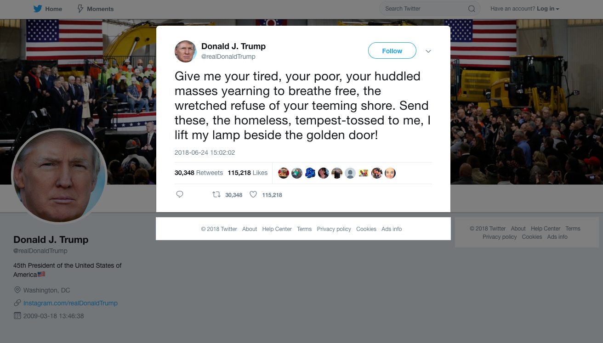
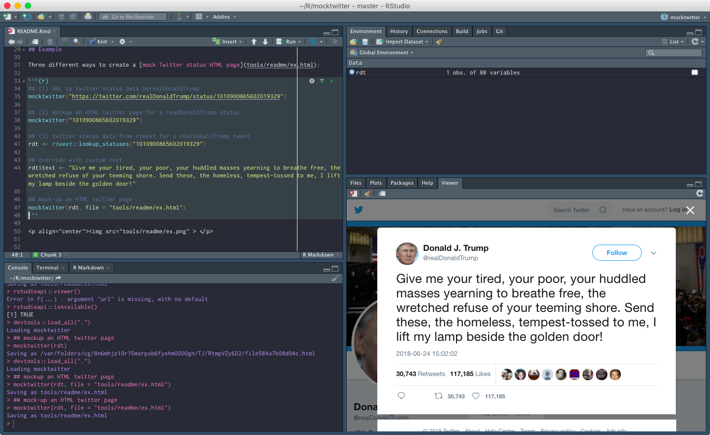

<!-- README.md is generated from README.Rmd. Please edit that file -->

# mocktwitter

🐧🐦 Generate HTML pages for Twitter statuses.

## Installation

You can install the current version of mocktwitter from
[Github](https://github.com) with:

``` r
## install from github
devtools::install_github("mkearney/mocktwitter")
```

## Example

Three different ways to create a [mock Twitter status HTML
page](https://htmlpreview.github.io/?https://github.com/mkearney/mocktwitter/blob/master/tools/readme/ex.html):

``` r
## (1) URL to twitter status data byrealDonaldTrump
mocktwitter("https://twitter.com/realDonaldTrump/status/1010900865602019329")

## (2) mockup an HTML twitter page for a readDonaldTrump status
mocktwitter("1010900865602019329")

## (3) twitter status data from rtweet for a realDonaldTrump tweet
rdt <- rtweet::lookup_statuses("1010900865602019329")

## override with custom text
rdt$text <- "Give me your tired, your poor, your huddled masses yearning to breathe free, the wretched refuse of your teeming shore. Send these, the homeless, tempest-tossed to me, I lift my lamp beside the golden door!"

## mock-up an HTML twitter page
mocktwitter(rdt, file = "tools/readme/ex.html")
```

<p align="center">



</p>

In Rstudio, a preview will be displayed in the viewer pane.

<p align="center">



</p>
